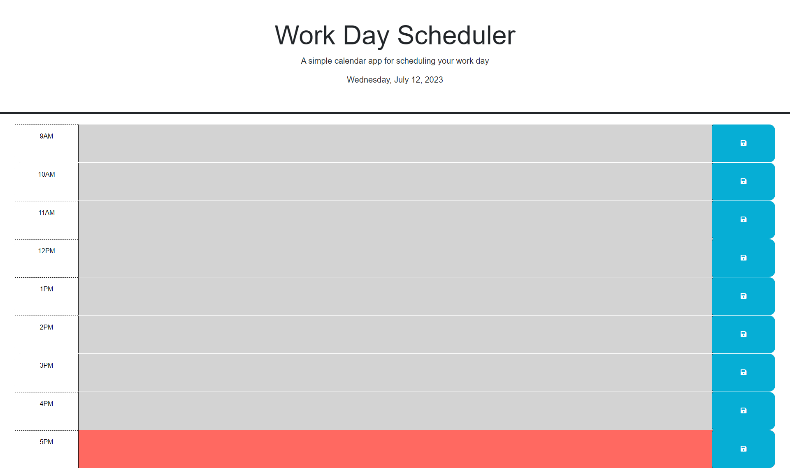

# <daily-planner>

## Description

My motivation to create this project was to make a daily planner for myself to help organize my work day better. This planer will be helpful to organize my work day, and show me when the time has past certain sections. The daily planner saves all of the info into my local storage, so when I reopen the webpage it will have everything I've planned for my day ready for me! I was able to lear a lot about jquery, JavaScript, local storage, and how useful APIs are in coding projects.

## Usage

This is a webpage that can be used to help plan your work day every day! Helps the user to know when time has passed throughout the day, and to be able to come back and look at what they have saved.

## Credits

jQuery: https://jqueryui.com/

Dayjs: https://day.js.org/

MDN local storage docs: https://developer.mozilla.org/en-US/docs/Web/API/Window/localStorage

# License

Please refer to the LICENSE in the repo.